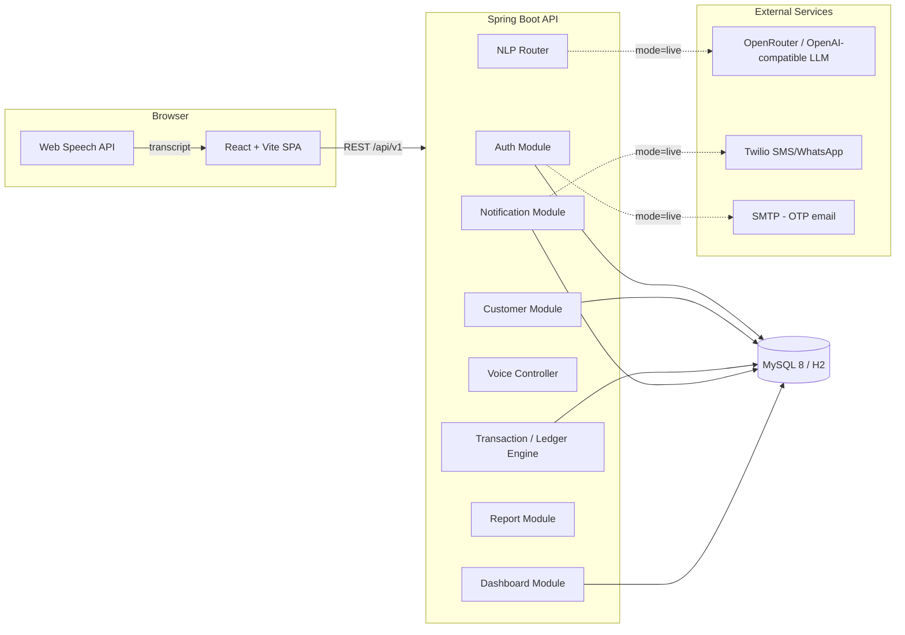
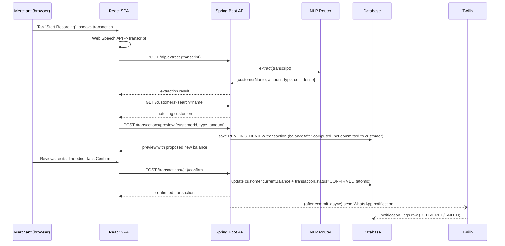

# Architecture

## System overview

## Voice → Ledger sequence

## Ledger balance convention

- `UDHAAR` (credit given) → `customer.currentBalance += amount` (customer owes more — "Lena Hai")
- `JAMA` (payment received) → `customer.currentBalance -= amount` (customer owes less)
- A positive `currentBalance` = merchant is owed money (Lena Hai). A negative balance = merchant
  owes the customer an advance/refund (Dena Hai). This mirrors the PPT/PRD's CREDIT/DEBIT convention.

## Mock vs live modes

| Concern | Env var | mock (default) | live |
|---|---|---|---|
| OTP delivery | `OTP_MODE` | OTP generated + BCrypt-hashed + validated normally; printed to backend console instead of emailed | Sent via SMTP (Spring Mail) |
| NLP extraction | `LLM_MODE` | Deterministic rule-based Hindi/Hinglish parser (`RuleBasedNlpService`) | Calls an OpenAI/OpenRouter-compatible chat-completions endpoint; automatically falls back to the rule-based parser if the live call fails |
| Notifications | `NOTIFY_MODE` | Twilio call is skipped; message is logged and a `notification_logs` row is written with a `mock-*` reference | Real Twilio SMS/WhatsApp send |

## Module boundaries (backend)

Each module follows `controller / service / repository / entity / dto`:

- **auth** — OTP request/verify, JWT issue/refresh
- **merchant** — merchant entity, created lazily on first OTP request
- **customer** — CRUD, always scoped by `merchantId` from the JWT, never from the request body
- **transaction** — the ledger engine: preview (pending) → confirm (atomic balance update + event)
- **nlp** — `NlpServiceRouter` picks rule-based vs live LLM; `LlmResponseParser` is unit-testable
  independent of any HTTP call
- **voice** — thin endpoint that currently just echoes a client-transcribed string; the extension
  point for a future server-side Whisper integration
- **notification** — Twilio wrapper + `TransactionalEventListener(phase = AFTER_COMMIT)` consumer
- **report** — statement generation + PDF (openhtmltopdf) / Excel (Apache POI) export
- **dashboard** — read-only aggregation endpoints powering the Merchant Command Centre screen

## Frontend structure

Pages map 1:1 to the CredLink Stitch UI design (Deep Emerald `#0D5C3A` / Navy `#0F1E36` / Saffron
`#E06D14`, Outfit + Inter typography — see `frontend/tailwind.config.js`):

- `Dashboard` — Merchant Command Centre (summary cards, voice quick-entry, trend chart, overdue list)
- `VoiceReview` — the 6-state voice HUD (Idle → Listening → Transcribing → Extracting → Review →
  Confirmed/Failed), live transcript, editable review card
- `Customers` / `CustomerDetail` — Khatabook list + per-customer running ledger register
- `Reports` / `ReportDetail` — statement viewer with PDF/Excel export
- `TransactionNew` / `TransactionDetail` — manual entry and single-transaction view
