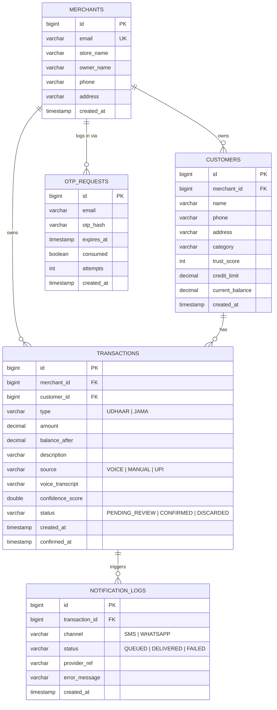

# Database Design

## Notes

- `customers.current_balance` is a **denormalized running total**, updated atomically alongside
  each `transactions` insert in the same DB transaction (see `TransactionService.confirm`). This
  keeps dashboard/list reads O(1) instead of re-summing history every time.
- `transactions.balance_after` snapshots what the balance became at that point in time — this is
  what makes the ledger register (and the "opening balance" of any date-ranged statement)
  reconstructable without re-walking the entire history.
- `otp_requests.otp_hash` stores a BCrypt hash, never the plaintext OTP. The plaintext is never
  logged either, except in `OTP_MODE=mock`, where it is printed to the **server console only**
  (clearly marked as dev-mode) so the login flow is testable without real email credentials.
- `otp_requests.attempts` counts failed verification attempts against that OTP; verification is
  locked out (`OTP_TOO_MANY_ATTEMPTS`) after 5, requiring a fresh OTP.
- `trust_score` and `credit_limit` on `customers` are additions beyond the original PRD schema,
  added to match the new Stitch UI mockups. Both are advisory only — nothing in the ledger engine
  enforces the credit limit as a hard block.
- `notification_logs.transaction_id = 0` is used for bulk/manual reminder sends that aren't tied
  to a single transaction (the "Send Bulk WhatsApp Payment Reminders" dashboard action).
